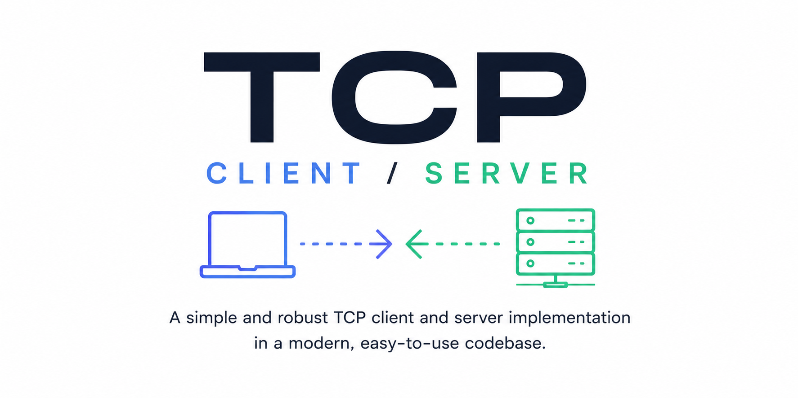

# tcp-chat

A simple TCP chat server written in Go.

## Prerequisites

- [Go 1.25+](https://go.dev/dl/)

## Getting started

Clone the repo and build the binary:

```bash
git clone https://github.com/edhollmon/tcp-chat.git
cd tcp-chat
go build -o tcp-chat .
```

Run the server:

```bash
./tcp-chat
# Listening on: :3000
```

The listen address defaults to `:3000`. Use the `-addr` flag to override it:

```bash
./tcp-chat -addr :8080
./tcp-chat -addr 0.0.0.0:9000
```

## Connecting as a client

### Via CLI

Use `nc` (netcat) — available on macOS and most Linux distros by default:

```bash
nc localhost 3000
```

Or `telnet`:

```bash
telnet localhost 3000
```

Type a message and press Enter. The server will log everything it receives.

### Programmatically

Add the client package to your Go module:

```bash
go get github.com/edhollmon/tcp-chat/client
```

Then connect and send messages:

```go
package main

import (
    "log"

    "github.com/edhollmon/tcp-chat/client"
)

func main() {
    c := client.NewSimpleTCPClient(":3000")
    if err := c.Connect(); err != nil {
        log.Fatal(err)
    }

    if err := c.Send("Hello World"); err != nil {
        log.Fatal(err)
    }
}
```

## Project structure

```
.
├── main.go                  # Entry point — starts the server and blocks until SIGINT
├── app.go                   # App struct wiring server lifecycle
├── server/
│   └── simple-server.go     # TCP listener and connection dispatch
└── client/
    └── simple-client.go     # TCP client — Connect and Send
```
